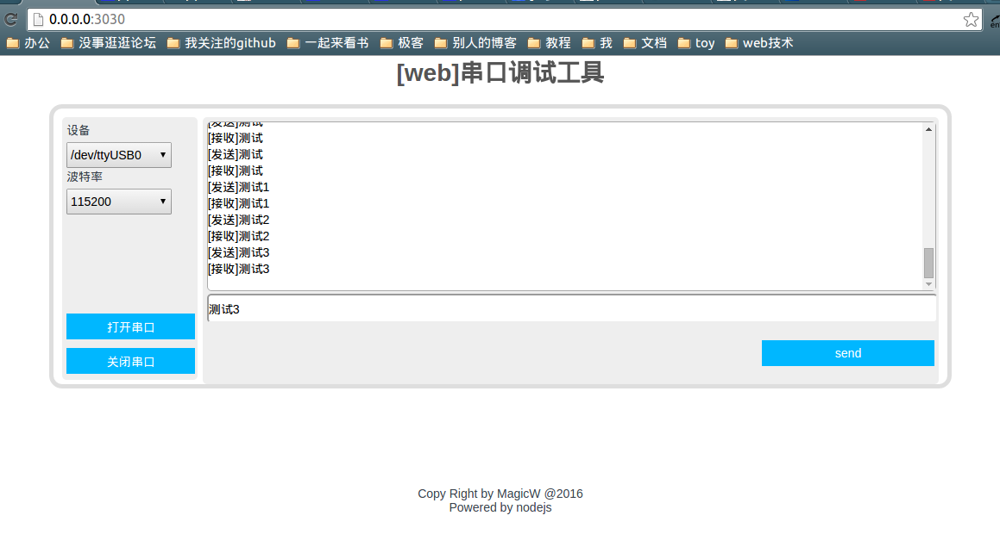

##serial-webDebug项目
--------

##简介
--------
对于web爱好者来说，在web上做一些事情真的很酷。这个项目通过使用serialport包调用底层的串口，完成串口的收发。和桌面软件的串口调试助手功能类似。
由于本人也是web新手，所以界面粗糙，代码组织的不够好。但是可以供大家参考和日常的使用。

##技术说明
--------
前端使用ejs模板引擎开发，通过jquery发起ajax请求与后端的nodejs进行交互。

##TODO
--------
1.使用websocket代替ajax，使其实时性更强
2.前端添加自定义波特率功能
3.添加定时发送功能
4.添加自动解析json数据功能
5. ...